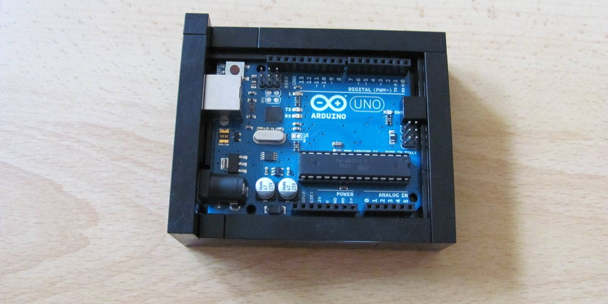
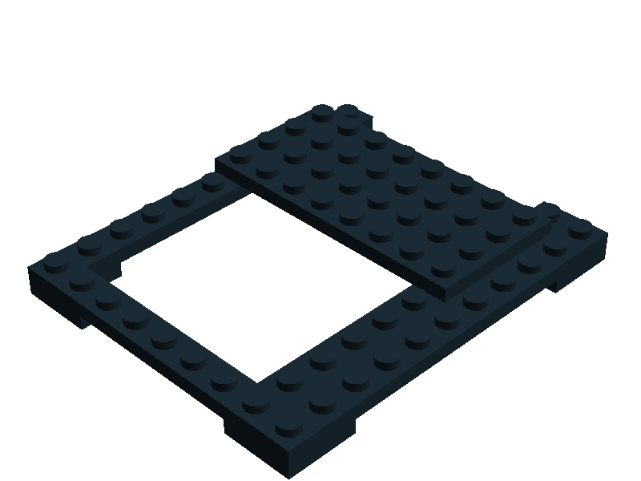

Lego Case for Arduino Uno
=========================



This is a smart case for your Arduino Uno built with Lego.
Its made with mostly available bricks so you can build your own.

**This Repository contains:**
* LDD (Lego Digital Designer) file
* Pictures
* Html building Instructions

**Note:** In my case I used a special fence brick which is a bit wider.
But I couldn't find this brick in the LDD. If anyone knows the brick ID, please message me.
The other brick is just a bit thinner. Picture of this brick is in the repository.

More Arduino projects + contact:

http://nicohood.wordpress.com/

Building Instructions
=====================

Also see the .lxf or the html website for more information.





Licence and Copyright
=====================

```
Copyright (c) 2014 NicoHood
See the readme for credit to other people.

Permission is hereby granted, free of charge, to any person obtaining a copy
of this software and associated documentation files (the "Software"), to deal
in the Software without restriction, including without limitation the rights
to use, copy, modify, merge, publish, distribute, sublicense, and/or sell
copies of the Software, and to permit persons to whom the Software is
furnished to do so, subject to the following conditions:

The above copyright notice and this permission notice shall be included in
all copies or substantial portions of the Software.

THE SOFTWARE IS PROVIDED "AS IS", WITHOUT WARRANTY OF ANY KIND, EXPRESS OR
IMPLIED, INCLUDING BUT NOT LIMITED TO THE WARRANTIES OF MERCHANTABILITY,
FITNESS FOR A PARTICULAR PURPOSE AND NONINFRINGEMENT. IN NO EVENT SHALL THE
AUTHORS OR COPYRIGHT HOLDERS BE LIABLE FOR ANY CLAIM, DAMAGES OR OTHER
LIABILITY, WHETHER IN AN ACTION OF CONTRACT, TORT OR OTHERWISE, ARISING FROM,
OUT OF OR IN CONNECTION WITH THE SOFTWARE OR THE USE OR OTHER DEALINGS IN
THE SOFTWARE.
```